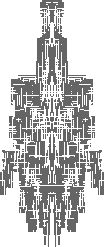

* * *

* [Dependencies](md/DEPENDENCIES.md)
* [Controls](md/CONTROLS.md)
* [The Future](md/FUTURE.md)

* * *

### 14/03/2019 

* Created these pages.
* Downloaded and tested software to help make a few youtube videos of the design / construction process.
* Various coding tweaks
* Started on a help menu
* Pondering whether or not to split the add blocks randomly and add block at cursor location functionality to different key mappings.

### ...
