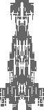
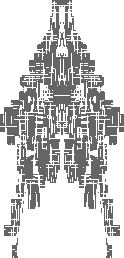

# Controls
* * *

### Mouse Controls 
* **Left Click** - Select Ships.
* **Middle Click** - Pan view.
* **Right Click** - Context menu.

### Context Menu
* Ship selected
    * **Name**
        * Manual
        * Random
    * **Save** - Saves selected Ship to file.
    * **Delete** - Deletes selected Ship.
    * **Clone** - Clones selected Ship.
        * Cloned copy will be on top of original.
    * **Merge** - Merges selected Ship with other Ships to create a new Ship.
        * Option will only appear when a valid merge is possible e.g. you have postioned the selected Ship over other Ship(s).
* No Ship selected
    * **Create Ship** - Creates a new ship centered at the mouse cursor location.
    * **Save all** - Saves all ships to file.
    * **Load** - Load Ship(s) from file.
    
    
### Keyboard Controls 
* **F1** 
    * Toggels viewing help.
* **home** 
    * Centers the view on the currently selected Ship.
* **F11** 
    * Toggles fullscreen view.
* **space** 
    * Cycles through random starting templates for the selected Ship.
* **a** 
    * Adds random blocks to ship / If mouse cursor is within the right half ship boundary it will create blocks at mouse cursor location.
* **s** 
    * Subtracts random blocks from ship / If mouse cursor is within the right half ship boundary it will subtract blocks at mouse cursor location.
* **d** 
    * Adds random lines to ship.
* **f** 
    * Flips the ship vertically.

* * *
[Back to menu](README.md)
