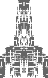

# Future
* * *

### Design 

* Ability to create turrets and place them at locations on the Ship.
* Mulit-tier ship?

### Survival

* Design vessels / fleet then pit them against increasingly difficult encounters. 
* Resources are gained after each encounter and can be spent to repair and upgrade vessels and purchase new modules. 
* Goal is to survive as long as you can.

AI will retreat / FTL out when outnumbered, but may come back in subsequent encounters - chance to jump in every game turn?
May provide an exciting named opponent that keeps coming back and causing grief.

### Opponent AI 
Create a competent AI opponent. Overall behavior e.g. aggressive, defensive, ... individual Vessel behaviors.

* * *
[Back to menu](../README.md)
